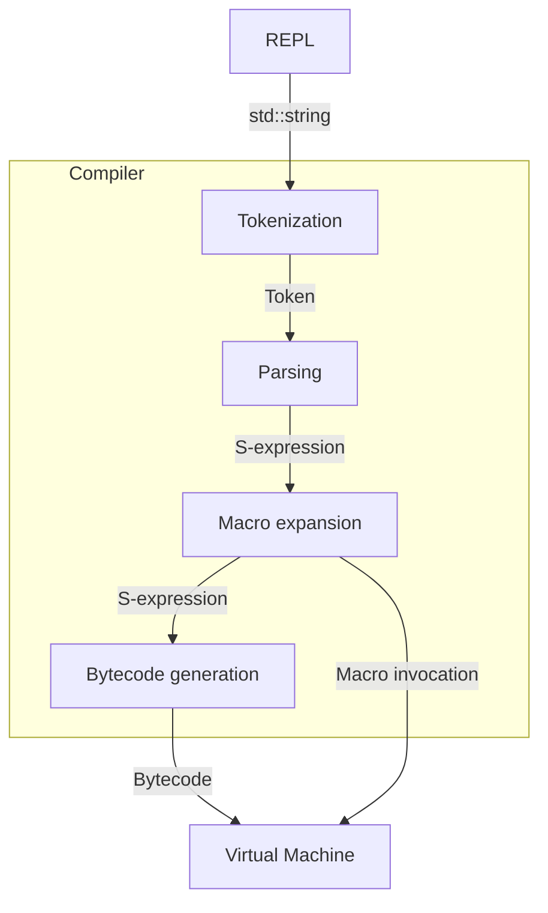

# Lisp Interpreter &middot; [](https://github.com/john-z-yang/lisp/actions/workflows/ci.yml)

Interpreter for a subset of Scheme written in C++. Implemented through a compiler and a virtual machine. (See [Technical Overview section](#technical-overview) for more details.)

<p align="center">
    
</p>

## Getting Started

These instructions will give you a copy of the interpreter up and running on
your machine.

### Prerequisites

- [g++](https://gcc.gnu.org/), or any C++ compiler that supports [C++20](https://en.cppreference.com/w/cpp/20) and [computed goto](https://gcc.gnu.org/onlinedocs/gcc/Labels-as-Values.html)
- [make](https://www.gnu.org/software/make/)

### Installing

Clone this repository.

```bash
git clone https://github.com/john-z-yang/lisp
```

Build the project. (**Note**: the default recipe will compile with sanitizers ([`ASan`](https://clang.llvm.org/docs/AddressSanitizer.html) and [`UBSan`](https://clang.llvm.org/docs/UndefinedBehaviorSanitizer.html)\) which will hinder performance, use `CXXFLAGS_ASAN` variable to control them).

```bash
make
```

The executable (`lisp`) will be in the `bin` directory.

Execute without argument to run in interactive mode.

```console
foo@bar:~$ bin/lisp
Lisp (C++ std: 202002, Nov 30 2022, 13:49:06)
Type "(quit)" or trigger EOF to exit the session.
lisp> (quote (Hello World!))
(Hello World!)
lisp> (quit)
Farewell.
foo@bar:~$
```

Supply the file name of a lisp script as the argument to run them.

```console
foo@bar:~$ echo '(display (quote (Hello World!)))' > hello_world.lisp
foo@bar:~$ bin/lisp hello_world.lisp
(Hello World!)
foo@bar:~$
```

Note: if you like to use the functions defined in `lisp/lib/`. You will need to set the `LISP_LIB_ENV` environment variable to its absolute path.

```console
foo@bar:~$ export LISP_LIB_ENV=/PATH/TO/lisp/lib
```

_Happy hacking!_

## Technical Overview

The interpreter is implemented through a [bytecode](https://en.wikipedia.org/wiki/Bytecode) compiler and [stack-based virtual machine](https://en.wikipedia.org/wiki/Stack_machine).



The bytecode compiler supports compliation of the following 7 primitive special forms:

- Atomic values
- Symbol assignments
- Ternary if expressions
- Function calls
- Lambda expressions
- Macro expansions
- Macro definitions

All other syntaxes are defined as macros, and are lowered/desugared into the 7 special forms. (see the `/lib` directory)

### Example

Source code

```lisp
(define fac
  (lambda (n)
    (cond ((or (not (num? n)) (< n 0))
           (display "Invalid argument for fac"))
          ((= n 0)
           1)
          (else
           (* n (fac (- n 1)))))))
```

<details>
<summary>Click to see the lowered/desugared S-expression (after macro expansion)</summary>

```lisp
(define fac
  (lambda (n)
    (if ((lambda (#:gensym-100) (if #:gensym-100 #:gensym-100 (< n 0))) (not (num? n)))
        (begin (display "Invalid argument for fac"))
    (if (= n 0)
        (begin 1)
    (if #t
        (begin (* n (fac (- n 1))))
    '())))))
```

</details>

<details>
<summary>Click to see the disassembly (after compilation)</summary>

```lisp
<Closure at 0x107cfcd50>, instance of:
    <Function at 0x10b0ae920, arity: 1, upvalues: 0>
Constants:
    <Function at 0x10b09bd20>, not, num?, display, "Invalid argument for fac", =, 0, 1, #t, *, fac, -, 1, ()
Bytecodes (raw):
    11 00 00 01 01 07 01 07 02 0c 01 01 01 01 01 01
    01 0f 00 0b 11 03 07 03 06 04 01 01 0e 00 30 07
    05 0c 01 06 06 01 02 0f 00 07 11 03 06 07 0e 00
    1e 06 08 0f 00 17 11 03 07 09 0c 01 07 0a 07 0b
    0c 01 06 0c 01 02 01 01 01 02 0e 00 02 06 0d 0d
    00 05 01 04 03 02
Bytecodes:
    2                  0 MAKE_NIL
    3                  1 MAKE_CLOSURE            <Function at 0x10b09bd20>
                                                 LOCAL 1
    3                  5 LOAD_SYM                not
    3                  7 LOAD_SYM                num?
    3                  9 LOAD_STACK              1
    3                 11 CALL                    1
    3                 13 CALL                    1
    3                 15 CALL                    1
    3                 17 POP_JUMP_IF_FALSE       11
    7                 20 MAKE_NIL
    4                 21 POP_TOP
    4                 22 LOAD_SYM                display
    4                 24 LOAD_CONST              "Invalid argument for fac"
    4                 26 CALL                    1
    4                 28 JUMP                    48
    5                 31 LOAD_SYM                =
    5                 33 LOAD_STACK              1
    5                 35 LOAD_CONST              0
    5                 37 CALL                    2
    5                 39 POP_JUMP_IF_FALSE       7
    7                 42 MAKE_NIL
    6                 43 POP_TOP
    6                 44 LOAD_CONST              1
    6                 46 JUMP                    30
    7                 49 LOAD_CONST              #t
    7                 51 POP_JUMP_IF_FALSE       23
    7                 54 MAKE_NIL
    8                 55 POP_TOP
    8                 56 LOAD_SYM                *
    8                 58 LOAD_STACK              1
    8                 60 LOAD_SYM                fac
    8                 62 LOAD_SYM                -
    8                 64 LOAD_STACK              1
    8                 66 LOAD_CONST              1
    8                 68 CALL                    2
    8                 70 CALL                    1
    8                 72 CALL                    2
    8                 74 JUMP                    2
    7                 77 LOAD_CONST              ()
    3                 79 SET_STACK               0
    3                 81 CLOSE_UPVALUE           1
    3                 83 POP                     3
    3                 85 RETURN

<Function at 0x10b09bd20, arity: 1, upvalues: 1>
Constants:
    <, 0
Bytecodes (raw):
    11 0c 01 0f 00 05 0c 01 0e 00 08 07 00 0a 00 06
    01 01 02 0d 00 04 03 02
Bytecodes:
    3                  0 MAKE_NIL
    3                  1 LOAD_STACK              1
    3                  3 POP_JUMP_IF_FALSE       5
    3                  6 LOAD_STACK              1
    3                  8 JUMP                    8
    3                 11 LOAD_SYM                <
    3                 13 LOAD_UPVALUE            0
    3                 15 LOAD_CONST              0
    3                 17 CALL                    2
    3                 19 SET_STACK               0
    3                 21 POP                     3
    3                 23 RETURN
```

</details>

### File structure

```text
.
├── bin                # Compiled binaries
├── docs               # Supporting documentation
├── lib                # Non-native Syntax/functions
├── src/
│   ├── code           # Source for Opcodes / Code Objects
│   ├── compile        # Source for compiler
│   ├── error          # Source for runtime/syntax errors
│   ├── repl           # Source for interactive environment
│   ├── runtime        # Source for VM and native functions
│   └── sexpr          # Source for s-expressions
└── tests              # Tests
```

## Running the tests

```bash
make test
```

Tests are defined in the `tests` directory. Each test suite is a pair of lisp code (`.lisp`) and its expected output (`.expect`).

The `test` command runs the `.lisp` file and generates a `.out` file by redirecting `stdout`. Finally, it `diff`s the `.out` file against the `.expect` file.

### Sample test suite (`combine`)

Lisp code (`combine.lisp`)

```lisp
(define combine
  (lambda (f)
    (lambda (x y)
      (if (null? x) (quote ())
        (f (list (car x) (car y))
           ((combine f) (cdr x) (cdr y)))))))

(define zip (combine cons))

(display (zip (list 1 2 3 4) (list 5 6 7 8)))
```

When executed, it should behave like this

```console
foo@bar:~$ bin/lisp combine.lisp
((1 5) (2 6) (3 7) (4 8))
foo@bar:~$
```

So we create the `.expect` file for expected output (`tests/combine.expect`).

```lisp
((1 5) (2 6) (3 7) (4 8))
```

Add the new test to the `TESTS` variable in `makefile`.

```make
TESTS = $(TESTDIR)/combine # Along with other tests.
```

Tests will be executed from `make test`.

```make
test: $(TESTS)

$(TESTDIR)/%: $(TESTDIR)/%.lisp $(TESTDIR)/%.expect $(OUTDIR)/lisp
    (export LISP_LIB_ENV=$(LIBDIR); $(OUTDIR)/lisp $@.lisp >> $@.out 2>&1)
    diff $@.expect $@.out
    rm $@.out
```

## Author

- **John Yang** - [john-z-yang](https://github.com/john-z-yang)

See also the list of
[contributors](https://github.com/john-z-yang/lisp/contributors)
who participated in this project.

## Acknowledgments

- [(How to Write a (Lisp) Interpreter (in Python))](http://www.norvig.com/lispy.html) by [Peter Norvig](https://norvig.com/)
- [Crafting Interpreters](https://craftinginterpreters.com) by [Bob Nystrom](https://journal.stuffwithstuff.com/)
- Special thanks to [Sophie](https://github.com/yqstan) for pointing out that parameter eval order is different across C++ compiler implementations.
- [Stackoverflow: What is a trampoline function?](https://stackoverflow.com/questions/189725/what-is-a-trampoline-function) Question by [Benoit](https://stackoverflow.com/users/10703/benoit), Solutions by toyvo (no longer active) and [Piotr Kukielka](https://stackoverflow.com/users/704905/piotr-kukielka).
- [By example: Continuation-passing style in JavaScript](https://matt.might.net/articles/by-example-continuation-passing-style/) by [Matt Might](https://matt.might.net/)
- [How to compile with continuations](https://matt.might.net/articles/cps-conversion/) by [Matt Might](https://matt.might.net/)
<br>

---
<p align=center>

</p>
