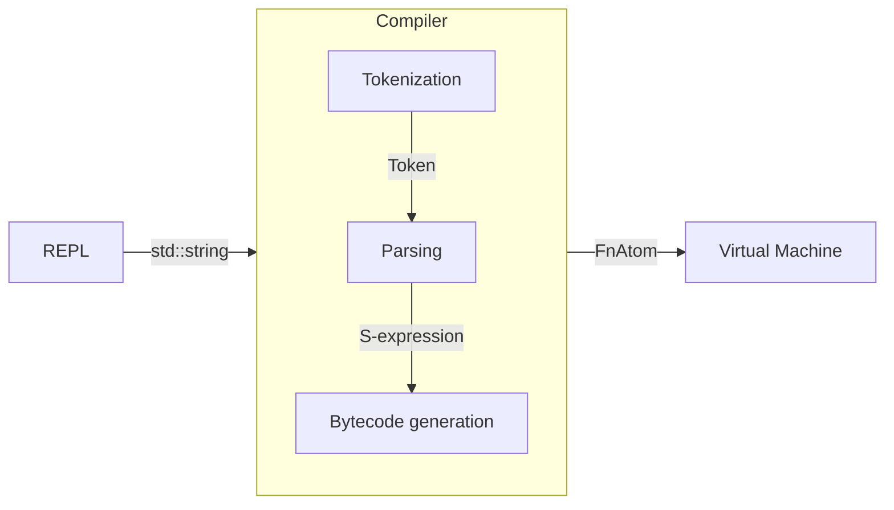

# Lisp Interpreter &middot; [](https://github.com/john-z-yang/lisp/actions/workflows/ci.yml)

Interpreter for a subset of Scheme written in C++. Implemented through [bytecode](https://en.wikipedia.org/wiki/Bytecode) compiler and [stack-based virtual machine](https://en.wikipedia.org/wiki/Stack_machine).

<p align="center">
    
</p>

## Getting Started

These instructions will give you a copy of the interpreter up and running on
your machine.

### Prerequisites

- [g++](https://gcc.gnu.org/), or any C++ compiler that supports [C++20](https://en.cppreference.com/w/cpp/20) and [computed goto](https://gcc.gnu.org/onlinedocs/gcc/Labels-as-Values.html)
- [make](https://www.gnu.org/software/make/)

### Installing

Clone this repository.

```bash
git clone https://github.com/john-z-yang/lisp
```

Build the project.

```bash
make
```

The executable (`lisp`) will be in the `bin` directory.

Execute without argument to run in interactive mode.

```console
foo@bar:~$ bin/lisp
Lisp (C++ std: 202002, Nov 30 2022, 13:49:06)
Type "(quit)" or trigger EOF to exit the session.
lisp> (quote (Hello World!))
(Hello World!)
lisp> (quit)
Farewell.
foo@bar:~$
```

Supply the file name of a lisp script as the argument to run them.

```console
foo@bar:~$ echo '(display (quote (Hello World!)))' > hello_world.lisp
foo@bar:~$ bin/lisp hello_world.lisp
(Hello World!)
foo@bar:~$
```

Note: if you like to use the functions defined in `lisp/lib/`. You will need to set the `LISP_LIB_ENV` environment variable to its absolute path.

```console
foo@bar:~$ export LISP_LIB_ENV=/PATH/TO/lisp/lib
```

_Happy hacking!_

## Special Forms

### Symbols

| Syntax                  | Description                                                                                     |
| ----------------------- | ----------------------------------------------------------------------------------------------- |
| **sym**                 | Returns the value that _sym_ is bound to in the closest lexical scope.                          |
| (**define** _sym expr_) | Evaluates _expr_, bind the result to _sym_ in current lexical scope.                            |
| (**set!** _sym expr_)   | Evaluates _expr_, find the closest lexical scope where _sym_ is bound, re-bind result to _sym_. |

### Macros

| Syntax             | Description                           |
| ------------------ | ------------------------------------- |
| (**quote** _expr_) | Returns _expr_ without evaluating it. |

### Procedures

| Syntax                                                      | Description                                                                                                                                                 |
| ----------------------------------------------------------- | ----------------------------------------------------------------------------------------------------------------------------------------------------------- |
| (**lambda** (_sym<sub>1</sub> ... sym<sub>n</sub>_) _expr_) | Produces a _procedure_ that accepts _n_ arguments. When invoked, bind each argument to a _sym_, evalulate _expr_ and return the result.                     |
| (**lambda** _sym expr_)                                     | Produces a _procedure_ that accepts arbitary number of arguments. When invoked, bind parameters to _sym_ as a list, evalulate _expr_ and return the result. |
| (**procedure** _expr\*_)                                    | Evaluates each _expr_, invoke _procedure_ with the results as arguments.                                                                                    |

### Logic

| Syntax                     | Description                                                                                 |
| -------------------------- | ------------------------------------------------------------------------------------------- |
| (**if** _test conseq alt_) | Evaluates _test_, if the result is _truthy_, evalulate _conseq_, evalulate _alt_ otherwise. |

### Syntactic Sugar

| Syntax      | equivalent         |
| ----------- | ------------------ |
| **'**_expr_ | (**quote** _expr_) |

## Built-In Functions

### Symbols

| Function         | Description                                          |
| ---------------- | ---------------------------------------------------- |
| (**sym?** _arg_) | Returns `#t` if _arg_ is a _symbol_, `#f` otherwise. |

### Intergers

| Function                                       | Description                                                                                            |
| ---------------------------------------------- | ------------------------------------------------------------------------------------------------------ |
| (**num?** _arg_)                               | Returns `#t` if _arg_ is a _number_, `#f` otherwise.                                                   |
| (**=** _num<sub>1</sub> ... num<sub>n</sub>_)  | Returns `#t` if all of the arguments are numerically equal, `#f` otherwise.                            |
| (**>** _num<sub>1</sub> ... num<sub>n</sub>_)  | Returns `#t` if all of the arguments in the given order are strictly increasing, `#f` otherwise.       |
| (**>=** _num<sub>1</sub> ... num<sub>n</sub>_) | Returns `#t` if all of the arguments in the given order are non-decreasing, `#f` otherwise.            |
| (**<** _num<sub>1</sub> ... num<sub>n</sub>_)  | Returns `#t` if all of the arguments in the given order are strictly decreasing, `#f` otherwise.       |
| (**<=** _num<sub>1</sub> ... num<sub>n</sub>_) | Returns `#t` if all of the arguments in the given order are non-increasing, `#f` otherwise.            |
| (**abs** arg)                                  | Returns \|arg\|.                                                                                       |
| (**+** _num<sub>1</sub> ... num<sub>n</sub>_)  | Returns the sum of all of the arguments, `0` if no arguments are provided.                             |
| (**-** _num<sub>1</sub> ... num<sub>n</sub>_)  | Returns num<sub>1</sub> - ... - num<sub>n</sub>, `0` - num<sub>1</sub> if no argument are provided.    |
| (**\*** _num<sub>1</sub> ... num<sub>n</sub>_) | Returns the product of all of the arguments, `1` if no arguments are provided.                         |
| (**/** _num<sub>1</sub> ... num<sub>n</sub>_)  | Returns num<sub>1</sub> ÷ ... ÷ num<sub>n</sub>, `1` ÷ num<sub>n</sub> if only 1 argument is supplied. |
| (**%** _lhs rhs_)                              | Returns lhs % rhs.                                                                                     |

### Strings

| Function                                              | Description                                                                                                                                 |
| ----------------------------------------------------- | ------------------------------------------------------------------------------------------------------------------------------------------- |
| (**str?** _arg_)                                      | Returns `#t` if _arg_ is _string_; otherwise return _#f_.                                                                                   |
| (**str-len** _arg_)                                   | Returns the length of _arg_.                                                                                                                |
| (**str-sub** _str_ _pos_ _len_)                       | Returns a new string that starts at character position _pos_ and spans _len_ characters (or until the end of _str_, whichever comes first). |
| (**str-con** _str<sub>1</sub>_ ... _str<sub>n</sub>_) | Returns a new string that is the concatenation of _str<sub>1</sub>_, ..., _str<sub>n</sub>_.                                                |
| (**->str** _arg_)                                     | Returns _arg_ in string representation.                                                                                                     |

### Pairs and Lists

| Function                                         | Description                                                                                                             |
| ------------------------------------------------ | ----------------------------------------------------------------------------------------------------------------------- |
| (**null?** _arg_)                                | Returns `#t` if arg is `'()`, `#f` otherwise.                                                                           |
| (**cons?** _arg_)                                | Returns `#t` if arg is a cons pair, `#f` otherwise.                                                                     |
| (**cons** _lhs rhs_)                             | Returns a pair where first element is lhs and second element is rhs.                                                    |
| (**car** _pair_)                                 | Returns the first element of pair.                                                                                      |
| (**cdr** _pair_)                                 | Returns the second element of pair.                                                                                     |
| (**list** _arg<sub>1</sub> ... arg<sub>n</sub>_) | Returns arg<sub>1</sub>, ..., arg<sub>n</sub> as a list (i.e. (cons arg<sub>1</sub> ... (cons arg<sub>n</sub>'())...)). |
| (**first** _list_)                               | Returns the first element if list is not empty, `'()` otherwise. (**Note:** list must be a properly formed list.)       |
| (**last** _list_)                                | Returns the last element if list is not empty, `'()` otherwise. (**Note:** list must be a properly formed list.)        |
| (**foldl** _fn cur list_)                        | For each element e in list, update cur as (fn e cur), returns cur when no element remains.                              |
| (**map** _fn list_)                              | Returns a new list where fn is applied to each element of list.                                                         |
| (**reverse** _list_)                             | Returns list but with its order of elements reversed.                                                                   |

### Predicates

| Function            | Description                                                          |
| ------------------- | -------------------------------------------------------------------- |
| (**proc?** _arg_)   | Returns `#t` if arg is _procedure_, `#f` otherwise.                  |
| (**eq?** _lhs rhs_) | Returns `#t` if lhs and rhs are equivalent in value, `#f` otherwise. |

### Miscellaneous

| Function            | Description                                                   |
| ------------------- | ------------------------------------------------------------- |
| (**quit**)          | Quits the session.                                            |
| (**dis** _closure_) | Prints the disassembled bytecode for _closure_, returns `'()` |
| (**display** _arg_) | Prints arg to std::cout, returns `'()`.                       |

## Running the tests

```bash
make test
```

Tests are defined in the `tests` directory. Each test suite is a pair of lisp code (`.lisp`) and its expected output (`.expect`).

The `test` command runs the `.lisp` file and generates a `.out` file by redirecting `stdout`. Finally, it `diff`s the `.out` file against the `.expect` file.

### Sample test suite (`combine`)

Lisp code (`combine.lisp`)

```lisp
(define combine
  (lambda (f)
    (lambda (x y)
      (if (null? x) (quote ())
        (f (list (car x) (car y))
           ((combine f) (cdr x) (cdr y)))))))

(define zip (combine cons))

(display (zip (list 1 2 3 4) (list 5 6 7 8)))
```

When executed, it should behave like this

```console
foo@bar:~$ bin/lisp combine.lisp
((1 5) (2 6) (3 7) (4 8))
foo@bar:~$
```

So we create the `.expect` file for expected output (`tests/combine.expect`).

```lisp
((1 5) (2 6) (3 7) (4 8))
```

Add the new test to the `TESTS` variable in `makefile`.

```make
TESTS = $(TESTDIR)/combine # Along with other tests.
```

Tests will be executed from `make test`.

```make
test: $(TESTS)

$(TESTDIR)/%: $(TESTDIR)/%.lisp $(TESTDIR)/%.expect $(OUTDIR)/lisp
	(export LISP_LIB_ENV=$(LIBDIR); $(OUTDIR)/lisp $@.lisp >> $@.out 2>&1)
	diff $@.expect $@.out
	rm $@.out
```

## Technical Details



## Author

- **John Yang** - [john-z-yang](https://github.com/john-z-yang)

See also the list of
[contributors](https://github.com/john-z-yang/lisp/contributors)
who participated in this project.

## Acknowledgments

- [(How to Write a (Lisp) Interpreter (in Python))](http://www.norvig.com/lispy.html) by [Peter Norvig](https://norvig.com/)
- [Crafting Interpreters](https://craftinginterpreters.com) by [Bob Nystrom](https://journal.stuffwithstuff.com/)
- Special thanks to [Sophie](https://github.com/yqstan) for pointing out that parameter eval order is different across C++ compiler implementations.
- [Stackoverflow: What is a trampoline function?](https://stackoverflow.com/questions/189725/what-is-a-trampoline-function) Question by [Benoit](https://stackoverflow.com/users/10703/benoit), Solutions by toyvo (no longer active) and [Piotr Kukielka](https://stackoverflow.com/users/704905/piotr-kukielka).
- [By example: Continuation-passing style in JavaScript](https://matt.might.net/articles/by-example-continuation-passing-style/) by [Matt Might](https://matt.might.net/)
- [How to compile with continuations](https://matt.might.net/articles/cps-conversion/) by [Matt Might](https://matt.might.net/)
<br>

---
<p align=center>

</p>
